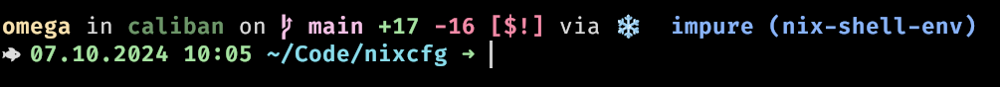

# nixcfg

[GitHub](https://github.com/pbek/nixcfg)

My personal NixOS config of my machines.

**Not be meant to be used by others**, but feel free to take inspiration from it.

## Screenhots

#### Shell



## Setup

Pick your hostname, you might find some inspiration [here](https://spaceplace.nasa.gov/review/switch-a-roo/planet_sizes.en.jpg).

Set your hostname and run the [install script](./install.sh):

```bash
# Start with a fresh NixOS installation in ~/Code/nixcfg
HOSTNAME=yourhostname bash <(curl -s https://raw.githubusercontent.com/pbek/nixcfg/main/install.sh)

# Initially build and switch to new configuration for host "yourhostname" after you adapted flake.nix and your configuration.nix
nix-shell -p git --run "sudo nixos-rebuild switch --flake .#yourhostname -L"
```

Afterward here are some useful commands:

```bash
# Build and switch to new configuration
make switch

# edit configuration.nix
kate . &

# check for Nvidia card
nix-shell -p pciutils --run 'lspci | grep VGA'

# look at network load and other stats?
nix-shell -p btop --run btop

# login at another computer and start the restic mount and restore

# take over tmux session at local system to watch restore
tmux new-session -A -s main

# after backup restore reboot computer
sudo reboot

# run backup script
```

In the end commit changes to https://github.com/pbek/nixcfg.

## Secrets

### Rekey after adding new host

This needs to be done if hosts were added.

- run `ssh-keyscan localhost` on new host
- add those keys to `./secrets/secret.nix`
- run `cd ./secrets && agenix -i ~/.ssh/agenix --rekey` to rekey all keys

### Add secret

```bash
cd ./secrets && agenix -i ~/.ssh/agenix -e secret-file.age
```

## Commands

```bash
# update just one flake (we need to set the github token so the API limit is not reached)
NIX_CONFIG="access-tokens = github.com=`cat ~/.secrets/github-token`" nix flake lock --update-input catppuccin
```

## Fix bootloader

If the UEFI "BIOS" gets corrupted and was reset, no NixOS EFI boot device will be found.
You can fix this with the following steps:

- boot [Ventoy](https://www.ventoy.net/) USB stick in **UEFI mode**
- start NixOS image
- load encrypted root partition with `gparted`

```bash
# as root
sudo su -

# mount encrypted root partition and boot partition
mount /dev/mapper/sda2_crypt /mnt
mount /dev/sda1 /mnt/boot

# install current flake including bootloader
cd /mnt/home/omega/Code/nixcfg
nixos-install --flake .#pluto

# reboot machine, "Linux Bootloader" should now be available in the UEFI boot menu
reboot
```

## Server setup with nixos-anywhere

```bash
# Test configuration build process in vm
nix run github:nix-community/nixos-anywhere -- --flake .#netcup02 --vm-test

# Build and test configuration in vm with ssh
make build-vm-netcup02
make boot-vm-server-console
make ssh-vm-server

# Deploy configuration to server "server-host"
nix run github:nix-community/nixos-anywhere -- --flake .#netcup02 root@server-host
```

## Desktop setup with nixos-anywhere

- <https://github.com/nix-community/nixos-anywhere>

```bash
# First boot into minimal nixos and set root password
# Then create a /tmp/secret.key with the disk-password locally (at least 8 characters for ZFS)
# Set `services.openssh.settings.PermitRootLogin = "yes";`
# Set `services.openssh.settings.PasswordAuthentication = true;`
# Then use nixos-anywhere remotely
nix run github:nix-community/nixos-anywhere -- --disk-encryption-keys /tmp/secret.key /tmp/secret.key --flake .#ally2 root@192.168.1.48
```

## Manual setup with disko

- <https://github.com/nix-community/disko>

```bash
# Boot some nixos minimal image (for a ZFS setup you need to have ZFS support enabled)
# If there is disk encryption, then create a /tmp/secret.key with the disk-password (at least 8 characters)
# Make sure you have nixcfg checked out and are in the nixcfg directory
export HOST=ally2
sudo nix --experimental-features nix-command --extra-experimental-features flakes run github:nix-community/disko -- --mode disko ./hosts/${HOST}/disk-config.zfs.nix
sudo nix --experimental-features nix-command --extra-experimental-features flakes run github:nix-community/disko -- --flake .#${HOST} --write-efi-entries
sudo nixos-install --flake .#${HOST}
```

## Todo after server setup

```bash
# Set password
passwd

# Clone nixcfg repository via https (read-only)
cd ~ && git clone https://github.com/pbek/nixcfg.git && cd nixcfg
# or via ssh (read-write)
cd ~ && git clone git@github.com:pbek/nixcfg.git && cd nixcfg

# Update channels, so command-not-found will work
sudo nix-channel --update
```
